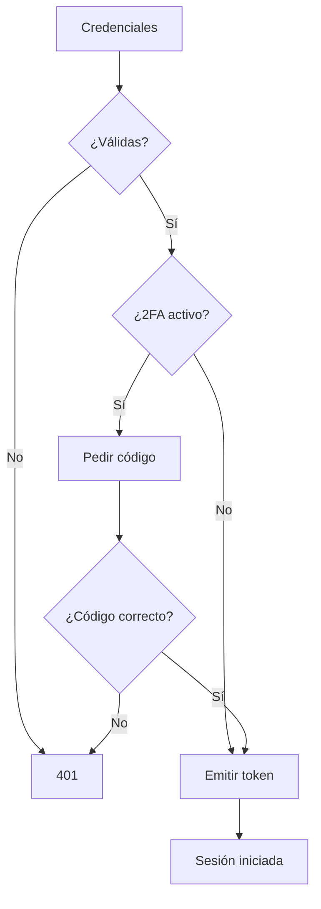

# Login

El usuario obtiene sesión con credenciales y segundo factor.

```mermaid
flowchart TD
    A[Credenciales] --> B{¿Válidas?}
    B -->|No| C[401]
    B -->|Sí| D{¿2FA activo?}
    D -->|No| F[Emitir token]
    D -->|Sí| E[Pedir código]
    E --> G{¿Código correcto?}
    G -->|No| C
    G -->|Sí| F
    F --> H[Sesión iniciada]
```

## Tareas

![[flujo-tareas.base]]
