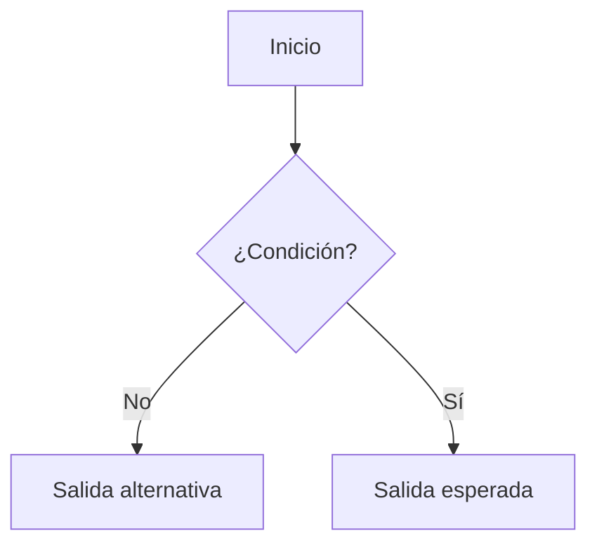

# Nombre del flujo

Una línea: qué consigue el usuario.

```mermaid
flowchart TD
    A[Inicio] --> B{¿Condición?}
    B -->|No| C[Salida alternativa]
    B -->|Sí| D[Salida esperada]
```

## Tareas

![[flujo-tareas.base]]
